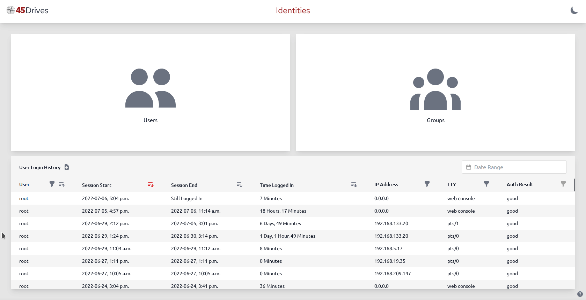

# Cockpit Identities
User and group management plugin for Houston UI (Cockpit)



## Features
### User Management
- Create delete user accounts
- Edit account details
	- Add and remove groups
	- Change home directory, login shell, account description
- Terminate session (sends SIGHUP to all of the user's processes)
- Manage credentials
	- Account login
		- Set/change password
		- Lock account
		- Manage password expiry
	- Samba
		- Set/change/remove Samba password (smbpasswd)
	- SSH
		- Generate passwordless public/private key pair
		- Copy public SSH key from UI to clipboard
		- Test passwordless SSH to a host
		- Manage authorized SSH access keys from other hosts
- View, filter, and export login history
### Group Management
- View groups and group members
- Create groups
- Delete groups (if it's a non-system, non-primary group)

# Installation
## Ubuntu 20.04
### From 45Drives Repo (Recommended, Ubuntu 20.04 only)
```bash
curl -sSL https://repo.45drives.com/setup | sudo bash
sudo apt update
sudo apt install cockpit-identities
```
### Direct from .deb
Installing this way may work for other versions of Ubuntu and Debian, but it is unsupported. You won't get automatic updates this way.
```bash
curl -LO https://github.com/45Drives/cockpit-identities/releases/download/v0.1.11/cockpit-identities_0.1.11-1focal_all.deb
sudo apt install ./cockpit-identities_0.1.11-1focal_all.deb
```
## Rocky 8
### From 45Drives Repo (Recommended, Rocky 8 only)
```bash
curl -sSL https://repo.45drives.com/setup | sudo bash
sudo dnf install cockpit-identities
```
### Direct from .rpm
Installing this way may work for other versions of Rocky/Centos/RHEL/Fedora/etc, but it is unsupported. You won't get automatic updates this way.
```bash
# dnf or yum
sudo dnf install https://github.com/45Drives/cockpit-identities/releases/download/v0.1.11/cockpit-identities-0.1.11-1.el8.noarch.rpm
```
## Generic Installation
1. Install Dependencies
```bash
# debian-like
cockpit
bash
coreutils
hostname
libc-bin
passwd
psmisc
samba
samba-common-bin
sudo
util-linux
perl
openssh-client
# RHEL-like
cockpit
bash
coreutils
glibc-common
hostname
passwd
psmisc
samba-common-tools
shadow-utils
sudo
util-linux
util-linux-user
perl
openssh
```
2. Download pre-built archive and install
```bash
curl -LO https://github.com/45Drives/cockpit-identities/releases/download/v0.1.11/cockpit-identities_0.1.11_generic.zip
unzip cockpit-identities_0.1.11_generic.zip
cd cockpit-identities_0.1.11_generic
# no need to run `make` first, the plugin is pre-built
sudo make install
```

If you haven't already, consider getting [cockpit-file-sharing](https://github.com/45drives/cockpit-file-sharing) for managing Samba and NFS shares.
